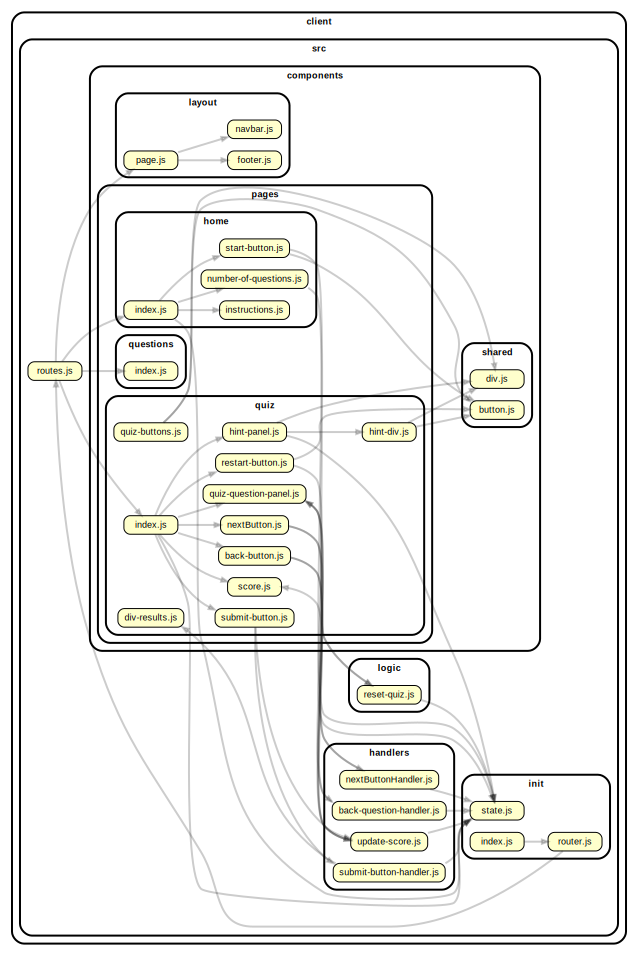

<!-- BEGIN TITLE -->

# DOCS

<!-- END TITLE -->

<!-- BEGIN TREE -->

> [interactive graph](./dependency-graph.html)

<!-- END TREE -->

<!-- BEGIN TOC -->

- components
  - layout
    - [footer.js](#clientsrccomponentslayoutfooterjs)
    - [navbar.js](#clientsrccomponentslayoutnavbarjs)
    - [page.js](#clientsrccomponentslayoutpagejs)
  - pages
    - home
      - [index.js](#clientsrccomponentspageshomeindexjs)
      - [instructions.js](#clientsrccomponentspageshomeinstructionsjs)
      - [number-of-questions.js](#clientsrccomponentspageshomenumber-of-questionsjs)
      - [start-button.js](#clientsrccomponentspageshomestart-buttonjs)
    - questions
      - [index.js](#clientsrccomponentspagesquestionsindexjs)
    - quiz
      - [back-button.js](#clientsrccomponentspagesquizback-buttonjs)
      - [hint-div.js](#clientsrccomponentspagesquizhint-divjs)
      - [hint-panel.js](#clientsrccomponentspagesquizhint-paneljs)
      - [index.js](#clientsrccomponentspagesquizindexjs)
      - [next-button.js](#clientsrccomponentspagesquiznext-buttonjs)
      - [nextButton.js](#clientsrccomponentspagesquiznextButtonjs)
      - [quiz-buttons.js](#clientsrccomponentspagesquizquiz-buttonsjs)
      - [quiz-question-panel.js](#clientsrccomponentspagesquizquiz-question-paneljs)
      - [restart-button.js](#clientsrccomponentspagesquizrestart-buttonjs)
  - shared
    - [button.js](#clientsrccomponentssharedbuttonjs)
    - [div.js](#clientsrccomponentsshareddivjs)
    - [input-greeting.js](#clientsrccomponentssharedinput-greetingjs)
- handlers
  - [back-question-handler.js](#clientsrchandlersback-question-handlerjs)
  - [change-greeting.js](#clientsrchandlerschange-greetingjs)
  - [nextButtonHandler.js](#clientsrchandlersnextButtonHandlerjs)
- init
  - [index.js](#clientsrcinitindexjs)
  - [router.js](#clientsrcinitrouterjs)
  - [state.js](#clientsrcinitstatejs)
- logic
  - [reset-quiz.js](#clientsrclogicreset-quizjs)
  - [reverse.js](#clientsrclogicreversejs)
- [routes.js](#clientsrcroutesjs)

---

<!-- END TOC -->

<!-- BEGIN DOCS -->

# /components

## /layout

<a href="../../client/src/components/layout/footer.js" id="clientsrccomponentslayoutfooterjs">../client/src/components/layout/footer.js</a>

## footer ⇒ <code>HTMLDivElement</code>

The shared footer.

**Returns**: <code>HTMLDivElement</code> - A rendered footer element.

<a href="../../client/src/components/layout/navbar.js" id="clientsrccomponentslayoutnavbarjs">../client/src/components/layout/navbar.js</a>

## navbar ⇒ <code>HTMLDivElement</code>

The shared navbar.

**Returns**: <code>HTMLDivElement</code> - A rendered nav bar element.

| Param  | Type                | Description                          |
| ------ | ------------------- | ------------------------------------ |
| routes | <code>object</code> | A routes object, see /src/routes.js. |

<a href="../../client/src/components/layout/page.js" id="clientsrccomponentslayoutpagejs">../client/src/components/layout/page.js</a>

## page ⇒ <code>HTMLDivElement</code>

The page layout component.

**Returns**: <code>HTMLDivElement</code> - A rendered page element.  
**Throws**:

- <code>TypeError</code> When the bodyComponent is not a function or DOM element.

| Param         | Type                                              | Description                               |
| ------------- | ------------------------------------------------- | ----------------------------------------- |
| bodyComponent | <code>function</code> \| <code>HTMLElement</code> | The body for the newly rendered page.     |
| routes        | <code>object</code>                               | The application's routes, for the navbar. |

---

## /pages

### /home

<a href="../../client/src/components/pages/home/index.js" id="clientsrccomponentspageshomeindexjs">../client/src/components/pages/home/index.js</a>

## home ⇒ <code>HTMLDivElement</code>

The home page.

**Returns**: <code>HTMLDivElement</code> - A rendered home page.

<a href="../../client/src/components/pages/home/instructions.js" id="clientsrccomponentspageshomeinstructionsjs">../client/src/components/pages/home/instructions.js</a>

<a href="../../client/src/components/pages/home/number-of-questions.js" id="clientsrccomponentspageshomenumber-of-questionsjs">../client/src/components/pages/home/number-of-questions.js</a>

<a href="../../client/src/components/pages/home/start-button.js" id="clientsrccomponentspageshomestart-buttonjs">../client/src/components/pages/home/start-button.js</a>

## startQuizButton ⇒ <code>object</code>

This function creates a start/restart button for the quiz page and resets the quiz state: last seen question, score, answers.

**Returns**: <code>object</code> - - A div element containing the button.

| Param      | Type                | Description                                |
| ---------- | ------------------- | ------------------------------------------ |
| buttonText | <code>string</code> | The text that will be shown on the button. |

---

### /questions

<a href="../../client/src/components/pages/questions/index.js" id="clientsrccomponentspagesquestionsindexjs">../client/src/components/pages/questions/index.js</a>

## questions ⇒ <code>HTMLDivElement</code>

The questions page.

**Returns**: <code>HTMLDivElement</code> - A rendered questions page.

---

### /quiz

<a href="../../client/src/components/pages/quiz/back-button.js" id="clientsrccomponentspagesquizback-buttonjs">../client/src/components/pages/quiz/back-button.js</a>

<a href="../../client/src/components/pages/quiz/hint-div.js" id="clientsrccomponentspagesquizhint-divjs">../client/src/components/pages/quiz/hint-div.js</a>

<a href="../../client/src/components/pages/quiz/hint-panel.js" id="clientsrccomponentspagesquizhint-paneljs">../client/src/components/pages/quiz/hint-panel.js</a>

<a href="../../client/src/components/pages/quiz/index.js" id="clientsrccomponentspagesquizindexjs">../client/src/components/pages/quiz/index.js</a>

## quiz ⇒ <code>HTMLDivElement</code>

The quiz page. Loads when the quiz page is requested.

**Returns**: <code>HTMLDivElement</code> - A rendered quiz page.

<a href="../../client/src/components/pages/quiz/next-button.js" id="clientsrccomponentspagesquiznext-buttonjs">../client/src/components/pages/quiz/next-button.js</a>

<a href="../../client/src/components/pages/quiz/nextButton.js" id="clientsrccomponentspagesquiznextButtonjs">../client/src/components/pages/quiz/nextButton.js</a>

<a href="../../client/src/components/pages/quiz/quiz-buttons.js" id="clientsrccomponentspagesquizquiz-buttonsjs">../client/src/components/pages/quiz/quiz-buttons.js</a>

<a href="../../client/src/components/pages/quiz/quiz-question-panel.js" id="clientsrccomponentspagesquizquiz-question-paneljs">../client/src/components/pages/quiz/quiz-question-panel.js</a>

<a href="../../client/src/components/pages/quiz/restart-button.js" id="clientsrccomponentspagesquizrestart-buttonjs">../client/src/components/pages/quiz/restart-button.js</a>

## createRestartQuizButtonPanel ⇒ <code>object</code>

This function creates a start/restart button for the quiz page and resets the quiz state: last seen question, score, answers.

**Returns**: <code>object</code> - - A div element containing the button.

---

---

## /shared

<a href="../../client/src/components/shared/button.js" id="clientsrccomponentssharedbuttonjs">../client/src/components/shared/button.js</a>

<a href="../../client/src/components/shared/div.js" id="clientsrccomponentsshareddivjs">../client/src/components/shared/div.js</a>

## divElement ⇒ <code>object</code>

This component creates a div element and returns it.

**Returns**: <code>object</code> - - A div element.

| Param      | Type                | Description                         |
| ---------- | ------------------- | ----------------------------------- |
| classNames | <code>string</code> | The class names of the div element. |
| id         | <code>string</code> | The unique id of the div element.   |

<a href="../../client/src/components/shared/input-greeting.js" id="clientsrccomponentssharedinput-greetingjs">../client/src/components/shared/input-greeting.js</a>

---

---

# /handlers

<a href="../../client/src/handlers/back-question-handler.js" id="clientsrchandlersback-question-handlerjs">../client/src/handlers/back-question-handler.js</a>

<a href="../../client/src/handlers/change-greeting.js" id="clientsrchandlerschange-greetingjs">../client/src/handlers/change-greeting.js</a>

<a href="../../client/src/handlers/nextButtonHandler.js" id="clientsrchandlersnextButtonHandlerjs">../client/src/handlers/nextButtonHandler.js</a>

---

# /init

<a href="../../client/src/init/index.js" id="clientsrcinitindexjs">../client/src/init/index.js</a>

<a href="../../client/src/init/router.js" id="clientsrcinitrouterjs">../client/src/init/router.js</a>

<a href="../../client/src/init/state.js" id="clientsrcinitstatejs">../client/src/init/state.js</a>

---

# /logic

<a href="../../client/src/logic/reset-quiz.js" id="clientsrclogicreset-quizjs">../client/src/logic/reset-quiz.js</a>

## Constants

<dl>
<dt><a href="#resetQuiz">resetQuiz</a></dt>
<dd>
This function reset the state of quiz:

<ul>
<li>resets indexOfRenderedQuestion,</li>
<li>resets currentScore, and</li>
<li>resets the state of each question.</li>
</ul>
</dd>
</dl>

## Functions

<dl>
<dt><a href="#resetQuestions">resetQuestions()</a></dt>
<dd>
This function resets the state of each question in the quiz:

<ul>
<li>resets answered property and</li>
<li>resets selected property of each available answer for each question.</li>
</ul>
</dd>
</dl>

## resetQuiz

This function reset the state of quiz:

- resets indexOfRenderedQuestion,
- resets currentScore, and
- resets the state of each question.

## resetQuestions()

This function resets the state of each question in the quiz:

- resets answered property and
- resets selected property of each available answer for each question.

<a href="../../client/src/logic/reverse.js" id="clientsrclogicreversejs">../client/src/logic/reverse.js</a>

## reverse ⇒ <code>string</code>

Reverses a string.

**Returns**: <code>string</code> - The reversed string.

| Param | Type                | Default                               | Description          |
| ----- | ------------------- | ------------------------------------- | -------------------- |
| [str] | <code>string</code> | <code>&quot;&#x27;&#x27;&quot;</code> | A string to reverse. |

---

<a href="../../client/src/routes.js" id="clientsrcroutesjs">../client/src/routes.js</a>

## routes

Defines the route URLs, names and callbacks.

<!-- END DOCS -->
